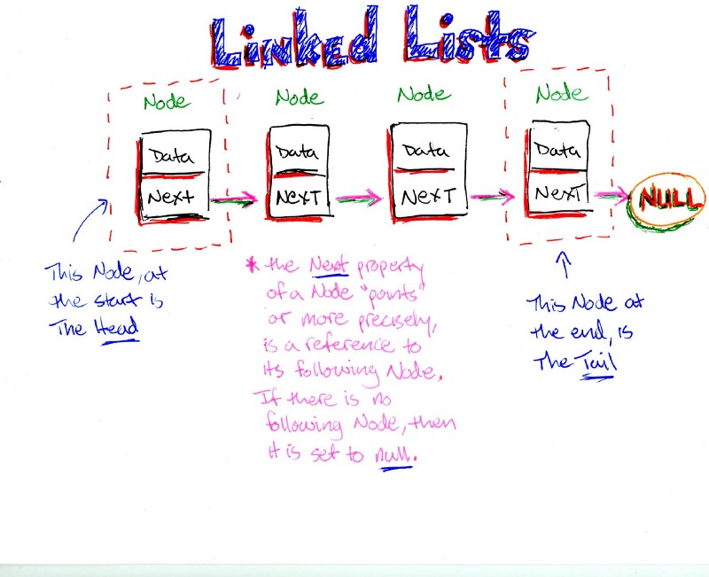

### Front end test

The test is splited in three parts
- creation of a linked list and tool functions to manipulate them
- two react components to display a linked list
- improve the react components style

Some part of the code *are dirty* but it's the purpose :)

## Part 1:

We want you to develop a library to handle linked lists in typescript. Some functions are already written.
You should :
- Write the missing functions
- Make sure every unit test passes

[more info about linked list](https://en.wikipedia.org/wiki/Linked_list)

## Part 2: 
 Two components are developped to display a linked list in react.
 - LinkedListManager.tsx manage the linked list
 - and NodeLinkedList.tsx store the data node
 
 
_Linked list is a muted data structure. So obviously, thoses react components are buggy (react don't like mutated data :) )__

So again, do not mute data in react components like in this repository !!

run tests 
`./node_modules/jest/bin/jest.js`

transpile code
`npx webpack`
